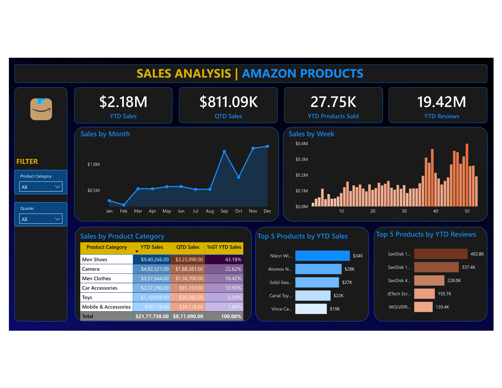

# 🛒 Amazon Product Sales Analytics Dashboard — Power BI

> A Microsoft Power BI dashboard analyzing **89,082 Amazon product listings** across 8 categories, 4 years (2019–2022), and multiple price tiers — built to surface product demand signals, category-level pricing intelligence, and customer sentiment trends that drive smarter catalog and merchandising decisions.


---

## 📌 Table of Contents

- [Business Problem](#-business-problem--objective)
- [Dashboard Preview](#-dashboard-preview)
- [Dataset Description](#-dataset-description)
- [Key Insights](#-key-insights)
- [Tools & Technologies](#️-tools--technologies)
- [DAX Measures](#-dax-measures--calculations)
- [How to Use](#-how-to-use)
- [Author](#-author)

---

## 🎯 Business Problem & Objective

Amazon sellers and category managers face a common but costly problem: **they have thousands of products but no unified view of where demand is concentrated, which price tiers perform best, or which categories are growing fastest.** Without this visibility, inventory investment, advertising spend, and catalog expansion happen on instinct rather than data.

This dashboard was designed to answer the strategic questions that matter most:

| Business Question | Dashboard Answer |
|---|---|
| Which product categories dominate the catalog? | Men Shoes (23,228) & Men Clothes (22,946) lead with 51% of all listings |
| Where is customer demand strongest — by reviews? | Men Clothes has 18.9M total reviews; Mobile & Accessories has the highest avg per product (1,419) |
| What is the price distribution across the catalog? | 51% of products are mid-range ($25–$100); only 2% are luxury (>$500) |
| Which category commands the highest prices? | Laptops average $1,000.96 — 10× the catalog average of $94.53 |
| Is the catalog growing or stagnating over time? | Listings grew 50% from 18,459 (2019) to 27,747 (2022) — a clear expansion signal |
| Which categories have untapped high-value opportunity? | Cameras (948 products) and Laptops (701 products) lead high-ticket listings (>$500) |
| What drives social proof and trust on Amazon? | Mobile & Accessories and Audio Video products earn the most reviews per listing on average |

**Objective:** Equip product managers, catalog analysts, and Amazon sellers with a data-driven lens to identify high-demand categories, optimize price positioning, and prioritize catalog investment.

---

## 📊 Dashboard Preview



> **Dataset Snapshot:**
> - Total Product Listings: **89,082**
> - Date Range: **January 2019 – December 2022**
> - Categories Covered: **8** (Men Shoes, Men Clothes, Camera, Toys, Car Accessories, Mobile & Accessories, Audio Video, Laptop)
> - Avg Product Price: **$94.53** | Median: **$46**
> - Avg Reviews per Product: **657** | Max: **406,442**

---

## 🗂️ Dataset Description

The dataset contains **89,082 Amazon product records** sourced from Excel, covering 8 product categories over 4 years with pricing, customer review volume, shipment availability, and order dates.

| Column | Description | Type | Sample Value |
|---|---|---|---|
| `Product Category` | Top-level category grouping | Categorical | Men Shoes, Camera, Laptop |
| `Product Description` | Full product title as listed on Amazon | Text | "JBL Flip 6 - Portable Bluetooth Speaker…" |
| `Price(Dollar)` | Listed product price in USD | Decimal | 27, 99, 1000 |
| `Number of reviews` | Total customer review count per product | Integer | 82,773 / 406,442 |
| `Shipment` | Shipment availability / destination | Categorical | "Ships to Bangladesh", "& Up" |
| `Order Date` | Date of data capture / listing date | Date | 2019-01-03 to 2022-12-31 |

**Derived / Calculated Fields (Power BI):**

| Calculated Field | Logic |
|---|---|
| `Price Segment` | Budget (<$25) / Mid ($25–$100) / Premium ($100–$500) / Luxury (>$500) |
| `Year` | Extracted from Order Date |
| `Review Tier` | Low / Medium / High / Viral based on review count thresholds |
| `Avg Price by Category` | DAX AVERAGEX per category context |
| `Total Reviews` | SUM of reviews per category / segment |

**Data Coverage:**

| Year | Product Listings |
|---|---|
| 2019 | 18,459 |
| 2020 | 19,170 |
| 2021 | 23,706 |
| 2022 | 27,747 |
| **Total** | **89,082** |

---

## 💡 Key Insights

All insights are derived directly from the 89,082-record dataset and framed as decision-ready findings — not just data descriptions.

### 📦 Catalog Composition & Growth

1. **The Amazon catalog in this dataset grew 50.3% over 4 years** — from 18,459 listings in 2019 to 27,747 in 2022. This compounding growth is not uniform; understanding which categories absorbed the most new listings reveals where sellers are betting on future demand. **Action:** Cross-reference YoY listing growth by category to identify emerging competitive categories before they become saturated.

2. **Men Shoes and Men Clothes together represent 51.8% of all 89,082 listings** (23,228 + 22,946) — making apparel the single most contested battleground. However, Men Shoes has an average price of $96.09 vs. Men Clothes at $50.91, giving shoes a 1.9× revenue-per-unit advantage. **Action:** Sellers in apparel should weight their mix toward footwear for higher revenue per listing.

3. **Toys is an underrated volume category** — 11,403 listings with an average price of only $31.06 and 637 average reviews per product. The low price ceiling limits revenue potential but high review volumes signal strong repeat consumer engagement. **Action:** Evaluate Toys for high-velocity, lower-margin bundling strategies.

### 💰 Pricing Intelligence

4. **Laptops are a high-commitment, low-volume category** — only 1,085 listings but an average price of **$1,000.96**, making them the highest-value category by 4.7× over the next highest (Camera at $211.23). With 701 products priced above $500, Laptops carry significant AOV (Average Order Value) potential. **Action:** For sellers prioritizing revenue over volume, Laptop and Camera categories offer the highest per-unit monetization opportunity.

5. **51.3% of all products fall in the $25–$100 mid-range price band** — this is Amazon's most competitive price corridor, where brand differentiation and review volume matter most. Only 2.1% of products (1,859 listings) are priced above $500. **Action:** Products entering the mid-range band need a minimum viable review strategy to compete — aim for 50+ reviews before expecting organic ranking.

6. **Budget products (<$25) represent 28.4% of the catalog (25,271 listings)** but likely drive disproportionate review velocity due to impulse purchase behavior. Mobile & Accessories and Audio Video have several budget products with 10,000+ reviews — evidence that low price + high utility = viral adoption. **Action:** Budget listings should be treated as top-of-funnel brand builders, not standalone revenue drivers.

### ⭐ Customer Sentiment & Demand Signals

7. **Mobile & Accessories generates the highest average reviews per product (1,419)** — nearly 2.2× the catalog average of 657. This indicates the highest per-product customer engagement of any category. The SanDisk 16GB 3-Pack (402,828 reviews) and SanDisk 1TB Extreme (337,401 reviews) are clear category anchors. **Action:** In Mobile & Accessories, attaching to high-review accessory ecosystems (memory cards, chargers) is a proven demand signal.

8. **Men Clothes holds the highest total review volume at 18.9 million** — nearly 72% more than Men Shoes (11.0M) despite a similar listing count, suggesting Men Clothes buyers are more prolific reviewers. This is a social proof advantage for the category. **Action:** Sellers in Men Clothes should leverage user-generated content and review campaigns more aggressively than any other category.

9. **Camera is the riskiest category by price variance** — with a minimum of $0, maximum of $16,775, and average of $211.23 across 11,726 listings. This extreme spread suggests a highly fragmented market mixing budget accessories (lens caps, bags) with professional equipment (DSLR bodies, cinema lenses). **Action:** Camera listings should be analyzed at sub-category level — accessories and bodies have fundamentally different competitive dynamics.

---

## 🛠️ Tools & Technologies

| Tool | Purpose |
|---|---|
| **Microsoft Power BI Desktop** | Dashboard design, data modeling, and interactive visualizations |
| **Microsoft Excel** | Raw data source — 89,082 product records across 6 columns |
| **Power Query** | Data cleaning, date parsing, price segmentation, null handling |
| **DAX (Data Analysis Expressions)** | KPI measures, YoY growth, price tier analysis, review aggregations |
| **Power BI Bing Maps** | Geographic visualization of shipment destinations |

---

## 🧮 DAX Measures & Calculations

```DAX
-- ─────────────────────────────────────────
-- 1. Year to Date Sales
-- ─────────────────────────────────────────
YTD Sales = TOTALYTD(SUM(Amazon_Data[Price(Dollar)]), 'Calendar Table'[Date])

-- ─────────────────────────────────────────
-- 2.Year to Date Review
-- ─────────────────────────────────────────
YTD Reviews = TOTALYTD(sum(Amazon_Data[Number of  reviews]), 'Calendar Table'[Date])

-- ─────────────────────────────────────────
-- 3. Total Reviews
-- ─────────────────────────────────────────
Total Reviews = SUM(Amazon_Data[Number of reviews])

-- ─────────────────────────────────────────
-- 4. Year to Date Product Sold
-- ─────────────────────────────────────────
YTD Products Sold = TOTALYTD(COUNT(Amazon_Data[Product Category]),'Calendar Table'[Date])

-- ─────────────────────────────────────────
-- 5. Quater to Date Sale
-- ─────────────────────────────────────────
QTD Sales = TOTALQTD(SUM(Amazon_Data[Price(Dollar)]), 'Calendar Table'[Date])

-- ─────────────────────────────────────────
-- 6. Creation of Calendar Table
-- ─────────────────────────────────────────
Calendar Table = CALENDAR(MIN(Amazon_Data[Order Date]), MAX(Amazon_Data[Order Date]))

```

---

## 🚀 How to Use

### For Recruiters & Viewers
The dashboard screenshot above provides a full visual overview. To explore the **interactive version**:

1. Download `Amazon_Sales_Analysis_Dashboard.pbix` from the `/dashboard` folder
2. Open it using **[Power BI Desktop](https://powerbi.microsoft.com/desktop/)** — free to download
3. Data is pre-embedded — no external connection or setup required
4. Use category, price segment, and year slicers to filter all visuals
5. Click any bar or chart element to cross-filter the entire dashboard

> 💡 *If Power BI prompts to update data source, navigate to: Home → Transform Data → Data Source Settings and point to `data/Amazon_Combined_Data.xlsx`*

---

## 📄 License

This project is licensed under the MIT License — see the [LICENSE](LICENSE) file for details.

---

## 👤 Author

**[ARSHAD K I SHAIKH]**
*Data Analyst | Power BI Developer | Ecommerce & Product Analytics*

[](https://linkedin.com/in/arshadkishaikh/)
[](https://github.com/Arshadkishaikh)

---

> 💼 *This project demonstrates end-to-end data analytics on a real-world 89K-record ecommerce dataset — covering Excel data ingestion, Power Query transformation, DAX modeling, and business-insight-driven dashboard design in Power BI.*

> ⭐ If this project helped or inspired you, please consider giving it a star!
